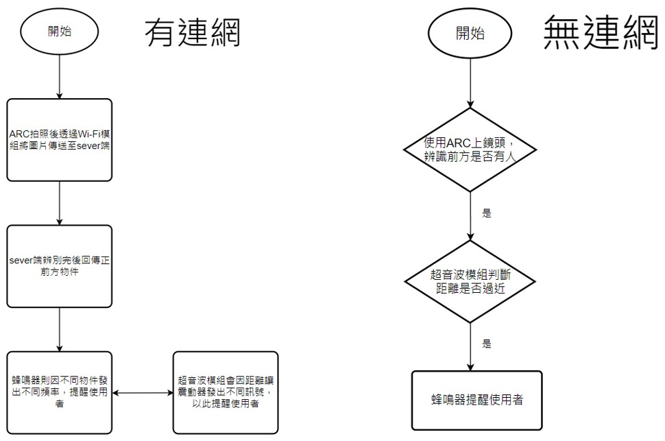
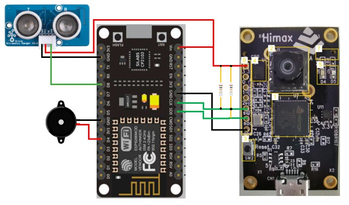

# 獨立/連網二合一智慧盲人輔助系統

## 作品概述
歷年比賽已有許多智能盲人輔助系統與盲人拐杖之提案，而近年在市面上也有數件智能盲人拐杖的發表，其功能強大但價格昂貴。上述之智能盲人輔助系統不論是比賽提案或是市售產品大多是以拐杖功能為主，但因高度的限制所能辨別的物件相對較少。
基於這點我們提出一個獨立/連網二合一智慧盲人輔助系統，利用ARC開發板判斷狀況來提醒盲人使用者
- 在連網時，我們將ARC開發板架設在眼鏡上，利用ARC上的鏡頭模組來做拍攝，接著透過Wi-Fi模組將影像傳送至sever端，當sever端分析完後回傳並告知使用者路況，若目標太過接近時，將以蜂鳴器的方式來做提醒。
在拐杖方面則是使用超音波模組及震動器，利用超音波及鏡頭的雙重驗證確保是否保持適當距離，通知使用者相關的警告提醒
- 在獨立(無連網)的情況下，利用ARC辨識前方是否有人，震動器通知使用者來當做最基本的物件感測提醒。

## 難點與創新
- 難點
    1. 開發板提供的燒錄空間太小經過測試要放置神經網路的模型大致上只能允許 `< 500kb` 的檔案大小，意味著無法放置較為精準的網路模型，以及框選目標範圍。
    2. 圖片回傳至 server，開發板提供有限的GPIO以至於若要擴充功能，勢必要外接許多電路來完成架構，目前透過 ESP8266 上傳 ARC 拍攝到的圖片到 server進行更精確的計算，並回傳至ARC來提醒使用著用路安全。
- 創新
    1. 鏡頭架設在墨鏡上，以便解決高度限制感測的問題。
    2. 獨立/連網二合一，有網路和沒網路都能夠透過拐杖與蜂鳴器提供基礎的警告提醒。

## 設計與實現

- 將 Himax WE-1 Plus 開發板用於主控以及影像識別。
- Wi-Fi 模組 - ESP8266 用於將圖片上傳至 server。
- 蜂鳴器模組作為簡易的提醒裝置。
- 拐杖安裝超音波模組，與鏡頭做雙重配合，用作偵測物件距離。
- 拐杖安裝振動模組，透過振動回饋使用者應加強注意。

## 作品進度
- 有連網的部分目前嘗試以 `yolo v5`作為物件識別的方法，訓練幾個路上常看到的物品以套用在我們的系統上。之前嘗試訓練識別模型並燒錄在ARC的板子上使用，但是礙於板子的燒錄空間不足，最多只能做到單一圖像的識別且無法框選定位。
- 無連網的部分已大略完成。當 ARC 識別到前方有人時，利用 I2C 協定將辨識結果傳送至 ESP8266 上，蜂鳴器則會因距離遠近發出不同警告。

### 模型訓練
使用 google tensorflow/research/slim 的 `mobilenet v1` 模型進行訓練，由於原專案提供資料與資料集對我們來說不敷使用，因此重新復刻了一版，並把有遺漏的部份補齊，以及說明清楚環境版本。
[Link](https://github.com/LeosyHsu/TFLite_on_Microcontroller)

### 系統流程圖

### 電路接線圖

### 測試影片
[無連線測試影片](video/)

